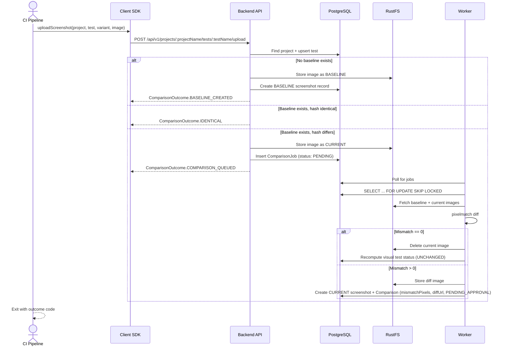

# Sequence Diagram: Upload Flow

```mermaid
sequenceDiagram
    actor CI as CI Pipeline
    participant SDK as Client SDK
    participant API as Backend API
    participant DB as PostgreSQL
    participant S3 as RustFS
    participant W as Worker

    CI->>SDK: uploadScreenshot(project, test, variant, image)
    SDK->>API: POST /api/v1/projects/:projectName/tests/:testName/upload

    API->>DB: Find project + upsert test
    alt No baseline exists
        API->>S3: Store image as BASELINE
        API->>DB: Create BASELINE screenshot record
        API-->>SDK: ComparisonOutcome.BASELINE_CREATED
    else Baseline exists, hash identical
        API-->>SDK: ComparisonOutcome.IDENTICAL
    else Baseline exists, hash differs
        API->>S3: Store image as CURRENT
        API->>DB: Insert ComparisonJob (status: PENDING)
        API-->>SDK: ComparisonOutcome.COMPARISON_QUEUED

        W->>DB: Poll for jobs
        W->>DB: SELECT ... FOR UPDATE SKIP LOCKED
        W->>S3: Fetch baseline + current images
        W->>W: pixelmatch diff
        alt Mismatch == 0
            W->>S3: Delete current image
            W->>DB: Recompute visual test status (UNCHANGED)
        else Mismatch > 0
            W->>S3: Store diff image
            W->>DB: Create CURRENT screenshot + Comparison (mismatchPixels, diffUrl, PENDING_APPROVAL)
        end
    end

    CI-->>CI: Exit with outcome code
```
